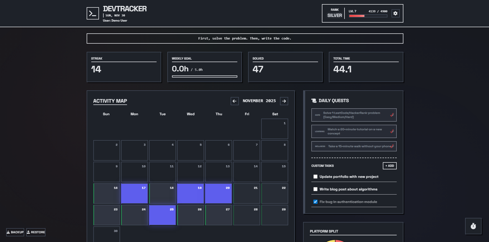
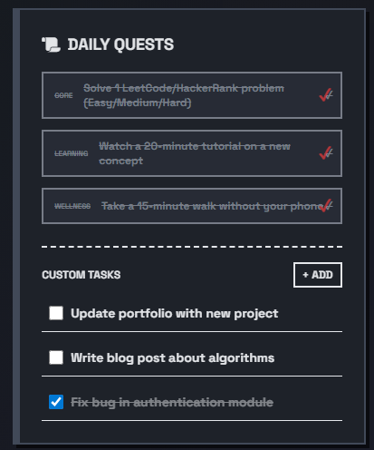
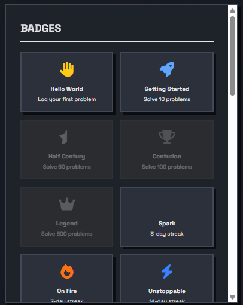
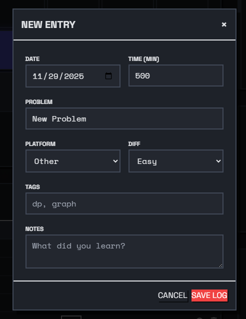
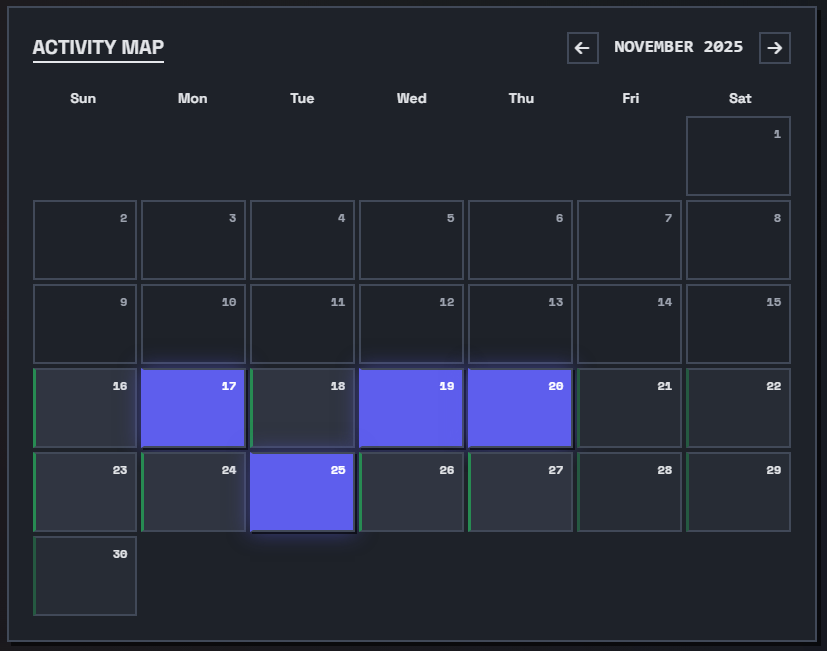
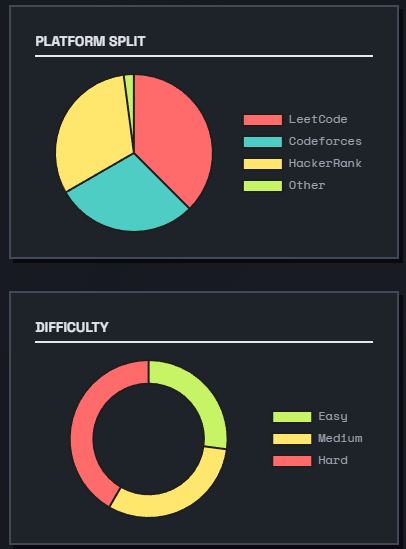
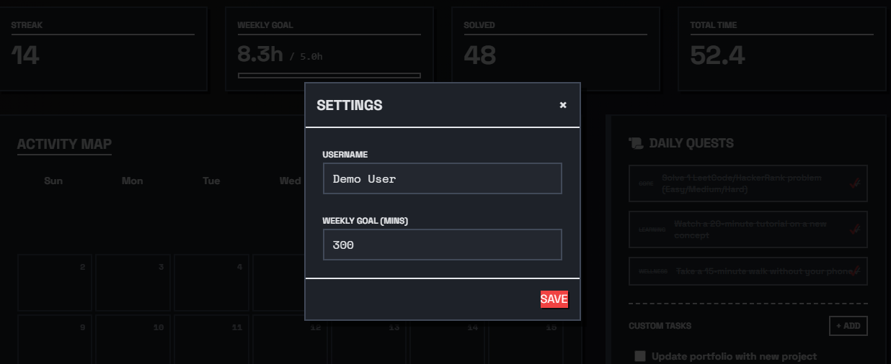

# DevTracker

A high-performance coding habit tracker with dark mode neo-brutalist design, gamification, and comprehensive analytics. Track your coding sessions, complete daily quests, unlock achievements, and level up your development skills.

 

## 📸 Screenshots

### Main Dashboard

Full view of the main interface showing header with rank, level, XP bar, stats cards, activity calendar heatmap, and recent activity table.

### Daily Quests

Daily quests section showing 3 active quests with category badges, progress indicators, and category color coding (Core, Learning, Wellness).

### Achievements

Badges section displaying unlocked badges with glow effects, locked badges in grayscale, and badge categories (Milestones, Streaks, Mastery, etc.).

### Log Entry Modal

New log entry form showing all input fields (date, problem name, platform, difficulty, time, tags, description) with neo-brutalist design.

### Activity Calendar

Close-up of the calendar heatmap showing different intensity levels (color-coded days) and month navigation.

### Analytics & Charts

Charts section showing difficulty distribution pie chart, platform usage chart, and weekly progress visualization.

### Focus Timer

Expanded timer widget showing timer display, Start/Pause/Stop buttons, and timer styling.

### Settings

Settings interface showing weekly goal input and other settings options.

## ✨ Features

### 📊 Core Tracking
- **Problem Logging**: Track LeetCode, HackerRank, Codeforces problems with time spent, difficulty, platform, and tags
- **Session Analytics**: View detailed statistics including total problems solved, hours coded, current streak, and weekly progress
- **Activity Calendar**: Visual heatmap showing your coding activity over time
- **Search & Filter**: Quickly find specific problems or sessions

### 🎮 Gamification
- **XP & Leveling System**: Earn XP for each problem solved (based on difficulty) and level up
- **Ranking System**: Progress through ranks (IRON → BRONZE → SILVER → GOLD → PLATINUM → DIAMOND)
- **28+ Achievements**: Unlock badges across multiple categories:
  - Milestones (Hello World, Centurion, Legend)
  - Streaks (Spark, On Fire, Unstoppable, Habitual, Dedication)
  - Mastery (Apprentice, Journeyman, Warrior, Grandmaster)
  - Platform-specific (LeetCode Fan, HackerRank Hero, CF Specialist)
  - Topic mastery (DP Master, Graph Guru, Arborist)
- **Daily Quests**: Complete 3 daily activities from Core, Learning, Wellness, Quick Win, and Review categories

### 🎨 Design & UX
- **Dark Mode Neo-Brutalist Design**: Sharp edges, high contrast, offset shadows
- **Smooth Animations**: Pulse effects, glows, slide-ins, and particle effects
- **Color-Coded Ranks**: Visual distinction for each rank level with glow effects
- **Responsive Layout**: Works seamlessly on desktop and mobile devices

### ⏱️ Focus Timer
- Built-in Pomodoro-style focus timer
- Track focused coding sessions
- Collapsible timer widget

### 📈 Analytics & Charts
- Weekly progress tracking
- Difficulty distribution charts
- Platform usage statistics
- Tag-based topic analysis

### 💾 Data Management
- **Local Storage**: All data stored locally in your browser using SQL.js (WebAssembly SQLite)
- **Export/Import**: Backup and restore your data
- **No Backend Required**: Fully client-side application
- **Demo Database**: Generate a sample database with 2 weeks of data to explore all features

## 🚀 Getting Started

### Quick Demo (Optional)
To see the app with sample data:
1. Open `generate-demo-db.html` in your browser
2. Click "Generate & Download Database"
3. In DevTracker, click "RESTORE" and select the downloaded `devtracker_demo.sqlite` file
4. Explore all features with pre-populated data!

## 📦 Installation

### Prerequisites
- A modern web browser (Chrome, Firefox, Edge, Safari)
- No installation or build process required!

### Installation

1. **Clone the repository**
   ```bash
   git clone https://github.com/yourusername/DevTracker.git
   cd DevTracker
   ```

2. **Open in browser**
   - Simply open `index.html` in your web browser
   - Or use a local server:
     ```bash
     # Using Python
     python -m http.server 8000
     
     # Using Node.js
     npx serve
     
     # Using PHP
     php -S localhost:8000
     ```

3. **Start tracking!**
   - Enter your name on first launch
   - Start logging your coding sessions
   - Complete daily quests and unlock achievements

## 📁 Project Structure

```
DevTracker/
├── index.html              # Main HTML file
├── css/
│   └── styles.css         # Custom styles and animations
├── js/
│   ├── db.js              # Database initialization and management
│   └── app.js             # Main application logic
├── generate-demo-db.html   # Demo database generator tool
└── README.md              # This file
```

## 🛠️ Technology Stack

- **HTML5**: Structure and markup
- **CSS3**: Styling with custom animations and neo-brutalist design
- **JavaScript (ES6+)**: Application logic
- **Tailwind CSS**: Utility-first CSS framework (via CDN)
- **SQL.js**: In-browser SQLite database using WebAssembly
- **Chart.js**: Data visualization for analytics
- **Canvas Confetti**: Celebration effects for achievements
- **Font Awesome**: Icons
- **Google Fonts**: Space Grotesk & Space Mono typography

## 📖 Usage Guide

### Logging a Problem
1. Click the **"+ NEW LOG"** button
2. Fill in the details:
   - Date
   - Problem name
   - Platform (LeetCode, HackerRank, etc.)
   - Difficulty (Easy, Medium, Hard)
   - Time spent (in minutes)
   - Tags (comma-separated)
   - Description/notes
3. Click **"SAVE"** to log the entry

### Daily Quests
- Each day, 3 quests are automatically generated
- Complete quests by logging coding sessions
- Quest progress updates automatically based on your activity
- Completed quests show a checkmark and celebration effects

### Achievements
- Achievements unlock automatically when you meet the requirements
- View all badges in the Badges section
- Unlocked badges have animations and glow effects
- Locked badges are shown in grayscale

### Focus Timer
- Click the timer icon in the bottom-right corner
- Start, pause, or stop your focus session
- Timer tracks your focused coding time

### Export/Import Data
- **Export**: Click "BACKUP" to download your database
- **Import**: Click "RESTORE" to upload a previously saved backup
- Data is stored as a SQLite file

## 🎯 Daily Quest Categories

- **Core**: Main coding activities (solving problems, building features)
- **Learning**: Educational activities (reading docs, tutorials, learning new concepts)
- **Wellness**: Health and well-being (walks, water breaks, ergonomics)
- **Quick Win**: Fast tasks (email cleanup, GitHub commits, shortcuts)
- **Review**: Reflection and planning (weekly reviews, goal setting)

## 🏆 Achievement Categories

1. **Milestones**: Problem count achievements
2. **Streaks**: Consecutive day achievements
3. **Mastery**: Difficulty-based achievements
4. **Platforms**: Platform-specific achievements
5. **Topics**: Tag-based topic mastery
6. **Dedication**: Time and consistency achievements

## 🎨 Design System

### Color Palette
- **Background**: Deep charcoal (`hsl(220 15% 10%)`)
- **Foreground**: Soft off-white (`hsl(220 10% 90%)`)
- **Primary**: Red (`hsl(0 85% 60%)`)
- **Accent**: Blue (`hsl(240 80% 65%)`)
- **Success**: Green (`hsl(142, 71%, 45%)`)
- **Warning**: Yellow (`hsl(48, 96%, 50%)`)

### Typography
- **Primary Font**: Space Grotesk
- **Monospace Font**: Space Mono

### Shadows
- Neo-brutalist offset shadows with 60% opacity
- `shadow-sm`: 2px 2px 0 0
- `shadow-md`: 4px 4px 0 0
- `shadow-lg`: 8px 8px 0 0

## ⌨️ Keyboard Shortcuts

- `Escape`: Close any open modal
- `Ctrl + Enter`: Save log entry (when log modal is open)

## 🔒 Privacy & Data

- **100% Local**: All data is stored in your browser's localStorage
- **No Tracking**: No analytics, no external requests (except CDN resources)
- **No Backend**: Fully client-side application
- **Your Data**: You own and control all your data

## 🐛 Troubleshooting

### Data Not Saving
- Check browser localStorage quota (usually 5-10MB)
- Try exporting your data and clearing browser cache
- Ensure JavaScript is enabled

### Quests Not Generating
- Refresh the page
- Check browser console for errors
- Ensure database is properly initialized

### Performance Issues
- Clear old log entries if database becomes too large
- Export and import to optimize database
- Close other browser tabs to free memory

## 🤝 Contributing

Contributions are welcome! Please feel free to submit a Pull Request.

1. Fork the repository
2. Create your feature branch (`git checkout -b feature/AmazingFeature`)
3. Commit your changes (`git commit -m 'Add some AmazingFeature'`)
4. Push to the branch (`git push origin feature/AmazingFeature`)
5. Open a Pull Request

## 📝 License

This project is licensed under the MIT License - see the LICENSE file for details.

## 🙏 Acknowledgments

- Built with [SQL.js](https://sql.js.org/) for in-browser SQLite
- Styled with [Tailwind CSS](https://tailwindcss.com/)
- Charts powered by [Chart.js](https://www.chartjs.org/)
- Icons from [Font Awesome](https://fontawesome.com/)
- Fonts from [Google Fonts](https://fonts.google.com/)

## 📧 Contact

For questions, issues, or suggestions, please open an issue on GitHub.

---

**Made with ❤️ for developers who want to track and improve their coding habits**

